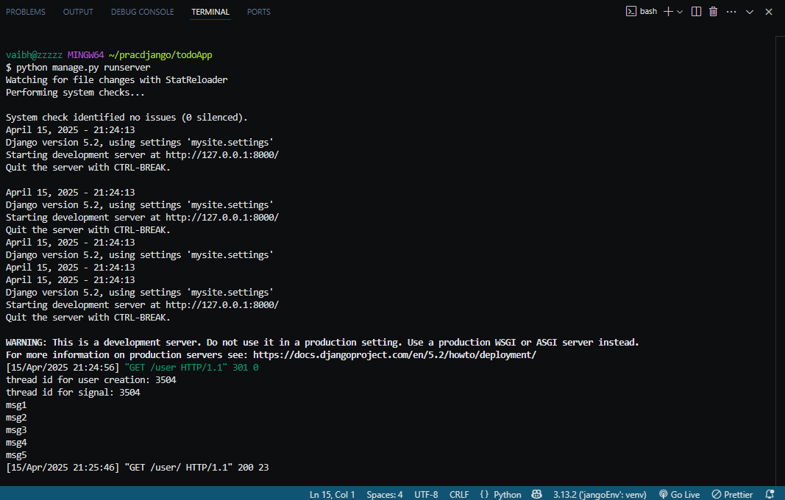

#Accuknox Task(django trainee)

the **master branch** contains the code for django related question 
and the code for python class in **rect branch**

## Instructions for running the code of the master branch 

1. Ensure that you have python installed 

    you can check it by running
    '''bash
        python --version

2. download a tool for creating virtual environment (if not already installed)

  use the command below to install the virtual env tool 

    pip install virtualenv

3.created a virtual environment ,make a directory 

    create virtual enviroment and activate it  by using the commands give below:
    python -m venv venv
    source venv/bin/activate

 for windows run command : your_env_name\Scripts\activate

4. cd your_directory

    after activating the environment create a directory by running

    mkdir your_dir

    now open it by running

    cd your_dir

    open in vscode(or open in editor of your choice),use the command below to open in vscode it will open the current folder in vscode

    code .

    

5.install django
    run the command given below to install django:

    pip install django 

now clone the repository in your_directory with 

git clone "https://github.com/ashishkumarko1904/accuknoxTask.git"

6.You do not need any database setup as the project uses sqllite which comes with django itself
 so  run the following commands in your vscode terminal(make sure you are in the project folder) to make migrations to your database

 python manage.py makemigrations
 python manage.py migrate

7. to run the server  run the command given below in your vscode terminal

    python manage.py runserver

#Instructions to run the code of the **rect branch**

the rect branch is completely unrelated to the master branch or django  you can run it by creating a virtual environment or without one it won't affect anything

open the this branch folder in a new vscode window then open the vscode terminal inside it 
and run it like any usual python program by  typing

    python main.py
 
the output of the tasks are shown below in the following images:

task 1 & task2:
 

task3:

task4:

